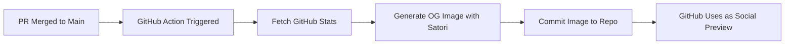

# GitHub Repository OG Image Generator

## Overview

Build an automated system that generates a custom Open Graph image for the npmx.dev GitHub repository whenever a PR is merged to main. The image will display live GitHub stats and be committed directly to the repo.

## Architecture



## Files to Create

### 1. GitHub Action Workflow

Create `[.github/workflows/og-image.yml](.github/workflows/og-image.yml)`:

- **Trigger**: `push` to `main` (covers merged PRs)
- **Permissions**: `contents: write` (to commit the image)
- **Steps**:
  1. Checkout repo
  2. Setup Node.js with pnpm
  3. Install dependencies for the script
  4. Run the OG image generator script
  5. Commit and push if image changed

### 2. OG Image Generator Script

Create `[scripts/generate-og-image.ts](scripts/generate-og-image.ts)`:

**Dependencies** (dev only, for the script):

- `satori` - Converts HTML/CSS to SVG
- `@resvg/resvg-js` - Converts SVG to PNG (faster than Sharp for this use case)
- `@octokit/rest` - GitHub API client

**Script responsibilities**:

1. Fetch GitHub stats via REST API:

- Stars: `GET /repos/{owner}/{repo}`
- Contributors: `GET /repos/{owner}/{repo}/contributors`
- Open issues: `GET /repos/{owner}/{repo}` (includes count)
- Forks: `GET /repos/{owner}/{repo}`

1. Define the image template (matching existing dark theme)
2. Generate image with Satori + resvg
3. Save to `.github/repo-og-image.png`

### 3. Image Template Design

**Exact replica of `[app/components/OgImage/Package.vue](app/components/OgImage/Package.vue)**` with different stats:

```
+------------------------------------------------------------+
|                                          [blur glow effect]|
|                                                            |
|   [box icon]  ./npmx                                       |
|   (64x64 blue)  ^blue  ^white                              |
|                                                            |
|   [star] 1.2k   [people] 42   [issue] 15   [fork] 89      |
|                                                            |
+------------------------------------------------------------+
```

**Layout Structure (matching Package.vue exactly)**:

1. **Container**: `h-full w-full flex flex-col justify-center px-20 bg-[#050505] text-[#fafafa] relative overflow-hidden`
2. **Logo Box** (lines 79-100 of Package.vue):

- 64x64px, `rounded-xl`, `shadow-lg`
- Background: `#60a5fa` (primaryColor)
- Contains the package/box SVG icon (white stroke)

1. **Title** (lines 102-107):

- `text-8xl font-bold tracking-tighter`
- Format: `./npmx`
- `./` in `#60a5fa` with `opacity-80`
- `npmx` in `#fafafa` (white)

1. **Stats Row** (lines 110-211):

- `flex items-center gap-5 text-4xl font-light text-[#a3a3a3]`
- **No version badge** - just 4 stats directly:
  - Stars (star icon from lines 166-177, filled with primaryColor)
  - Contributors (people icon)
  - Issues (circle-dot icon)
  - Forks (git-fork icon)

1. **Background Blur** (lines 214-217):

- Absolute positioned, top-right
- 550x550px circle, `blur-3xl`
- Color: `#60a5fa10` (primaryColor at 10% opacity)

**Styling**:

- Background: `#050505`
- Text: `#fafafa`
- Secondary text: `#a3a3a3`
- Accent/primaryColor: `#60a5fa`
- Font: Geist Sans
- Dimensions: 1200x630 (standard OG size)

**SVG Icons to use**:

- **Package icon** (logo): Use exact SVG from Package.vue lines 83-99
- **Star icon**: Use exact SVG from Package.vue lines 166-177
- **Contributors**: Use a people/users icon (similar style)
- **Issues**: Use a circle-dot icon (similar style)
- **Forks**: Use a git-branch/fork icon (similar style)

## Implementation Details

### Satori Template Structure

Satori uses React-like JSX. The script will use `satori` with a JSX template that mirrors Package.vue:

```tsx
// scripts/generate-og-image.ts
import satori from 'satori'
import { Resvg } from '@resvg/resvg-js'

const PRIMARY_COLOR = '#60a5fa'

const template = (
  <div
    style={{
      display: 'flex',
      flexDirection: 'column',
      justifyContent: 'center',
      width: '100%',
      height: '100%',
      padding: '80px',
      backgroundColor: '#050505',
      color: '#fafafa',
      fontFamily: 'Geist Sans',
      position: 'relative',
      overflow: 'hidden',
    }}
  >
    {/* Content wrapper */}
    <div style={{ display: 'flex', flexDirection: 'column', gap: '24px', zIndex: 10 }}>
      {/* Logo + Title row */}
      <div style={{ display: 'flex', alignItems: 'flex-start', gap: '16px' }}>
        {/* Logo box - 64x64, blue bg, package icon */}
        <div
          style={{
            display: 'flex',
            alignItems: 'center',
            justifyContent: 'center',
            width: 64,
            height: 64,
            borderRadius: 12,
            backgroundColor: PRIMARY_COLOR,
          }}
        >
          {/* Package SVG icon here */}
        </div>
        {/* Title: ./npmx */}
        <h1 style={{ fontSize: 96, fontWeight: 700, letterSpacing: '-0.05em' }}>
          <span style={{ color: PRIMARY_COLOR, opacity: 0.8 }}>./</span>
          npmx
        </h1>
      </div>

      {/* Stats row */}
      <div
        style={{
          display: 'flex',
          alignItems: 'center',
          gap: '20px',
          fontSize: 36,
          fontWeight: 300,
          color: '#a3a3a3',
        }}
      >
        {/* Star icon + count */}
        {/* Contributors icon + count */}
        {/* Issues icon + count */}
        {/* Forks icon + count */}
      </div>
    </div>

    {/* Background blur effect */}
    <div
      style={{
        position: 'absolute',
        top: -128,
        right: -128,
        width: 550,
        height: 550,
        borderRadius: '50%',
        backgroundColor: `${PRIMARY_COLOR}10`,
        filter: 'blur(48px)',
      }}
    />
  </div>
)
```

### GitHub API Usage

```typescript
import { Octokit } from '@octokit/rest'

const octokit = new Octokit({ auth: process.env.GITHUB_TOKEN })

const { data: repo } = await octokit.repos.get({
  owner: 'danielroe',
  repo: 'npmx.dev',
})

const { data: contributors } = await octokit.repos.listContributors({
  owner: 'danielroe',
  repo: 'npmx.dev',
  per_page: 1,
  anon: 'true',
})
// Note: Use Link header to get total count
```

### Commit Strategy

The workflow will:

1. Check if the generated image differs from the existing one
2. Only commit if there are changes (using `git diff --quiet`)
3. Use a bot commit message: `chore: update repository OG image [skip ci]`
4. The `[skip ci]` prevents infinite workflow loops

## File Structure

```
.github/
├── workflows/
│   └── og-image.yml          # New workflow
├── repo-og-image.png         # Generated image (committed)
scripts/
└── generate-og-image.ts      # Generator script
```

## Post-Implementation

After the image is generated and committed:

1. Go to GitHub repo Settings > General > Social preview
2. Upload `.github/repo-og-image.png` as the custom social preview
3. Alternatively, reference it in README for other uses

## Considerations

- **Rate Limits**: GitHub API has limits, but the workflow only runs on PR merge (infrequent)
- **Font Loading**: Satori requires font files; fetch Geist Sans from Google Fonts or bundle it
- **Image Caching**: GitHub caches OG images; changes may take time to propagate on social platforms
- **Skip CI**: The commit message includes `[skip ci]` to prevent triggering other workflows
